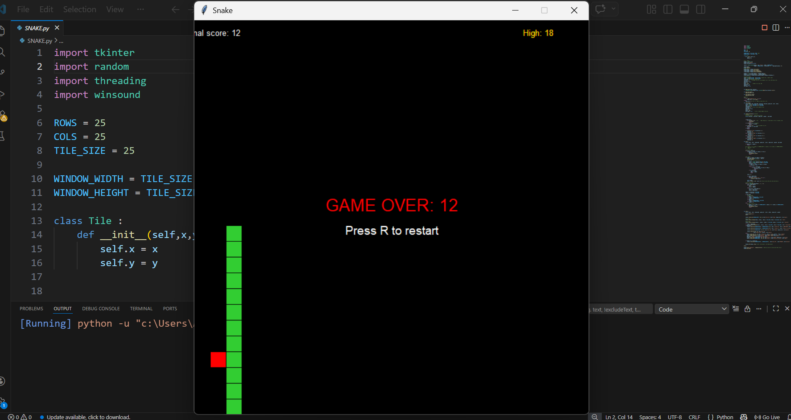
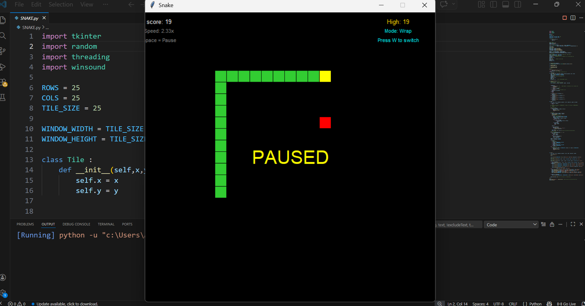

Snake Game 🐍
A classic Snake game implemented in Python using Tkinter.
This project features smooth controls, dynamic difficulty, two wall modes,
sound effects, and persistent high score tracking.

✨ Features

🎮 Classic Gameplay – Control the snake with arrow keys,
eat 🍎 food to grow, and avoid collisions.

🧱 Two Wall Modes – Toggle between Wall Death (game over on edge collision)
and Wrap‑Around (snake reappears on the opposite side) by pressing W.

⚡ Dynamic Speed – The snake speeds up as your score increases.
Current speed multiplier is displayed on screen.

🏆 High Score – Your best score is saved locally in highscore.txt
and loaded next time you play.

🔊 Sound Effects – Distinct beeps when eating food (900 Hz) 
and when game over (700 Hz).
Sounds run in a separate thread so they never lag the game.

⏯️ Pause / Resume – Press Spacebar to pause or resume the game.

🔄 Instant Restart – After a game over, press R (any keyboard layout) to start a new game.

🖥️ Clean UI – Real‑time display of current score, high score, speed, and wall mode.

🎮 How to Play
⬆️⬇️⬅️➡️ Arrow Keys → Move the snake (up, down, left, right)

⏸️ Spacebar → Pause / resume

🔁 W → Toggle wall mode (death / wrap)

🔄 R → Restart after game over

⚙️ Requirements
🐍 Python 3.x 

🪟 Tkinter (usually comes bundled with Python)

🔊 winsound (Windows only – for sound effects)
On other OS you can comment out the sound lines or replace with a cross‑platform library.

📦 All other modules (random, threading) are part of the Python standard library.

Enjoy the game! 🐍✨

